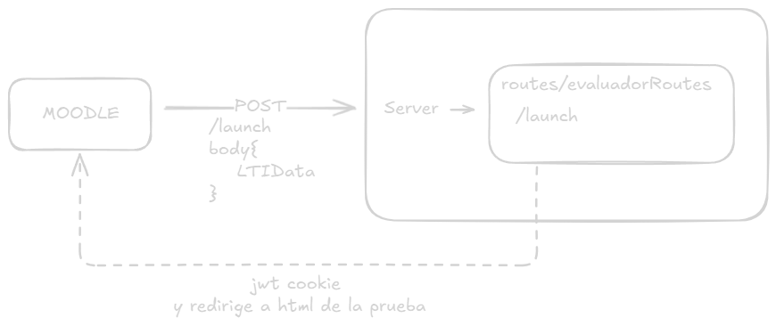

# Moodle herramienta externa

## Launch

1. El moodle lanza la app mediante una petición post a /launch. 
    - Dentro de la petición están los datos de usuario. Tal y como está en el formato del type LTIData que se encuentra en la carpeta de tipos.
2. El endpoint post crea un JWT con la req y regresa la peti con las cookies de sección.
3. El endpoint redirige al html de la prueba. 

## Tipos

Los tipos de uso global están en la carpeta types. Se pueden exportar todos desde el archivo barril.

